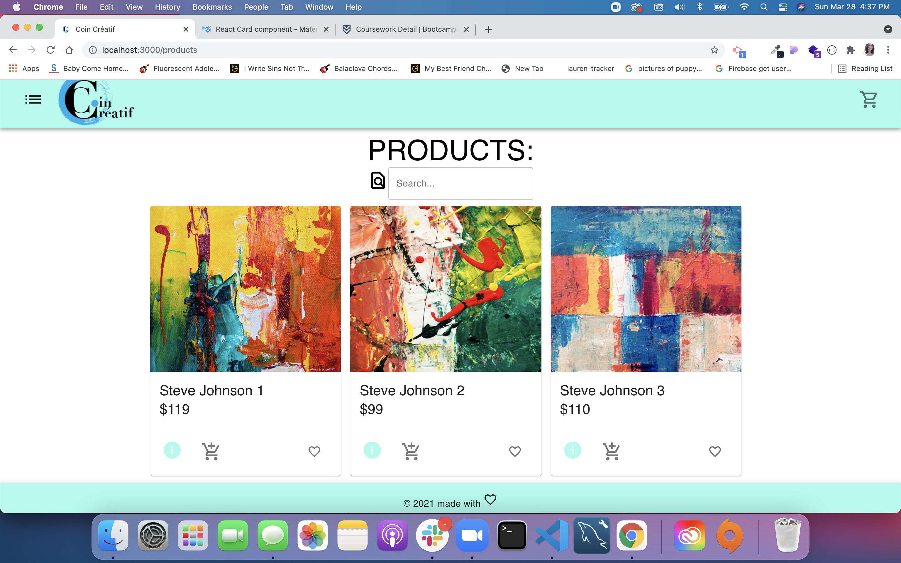
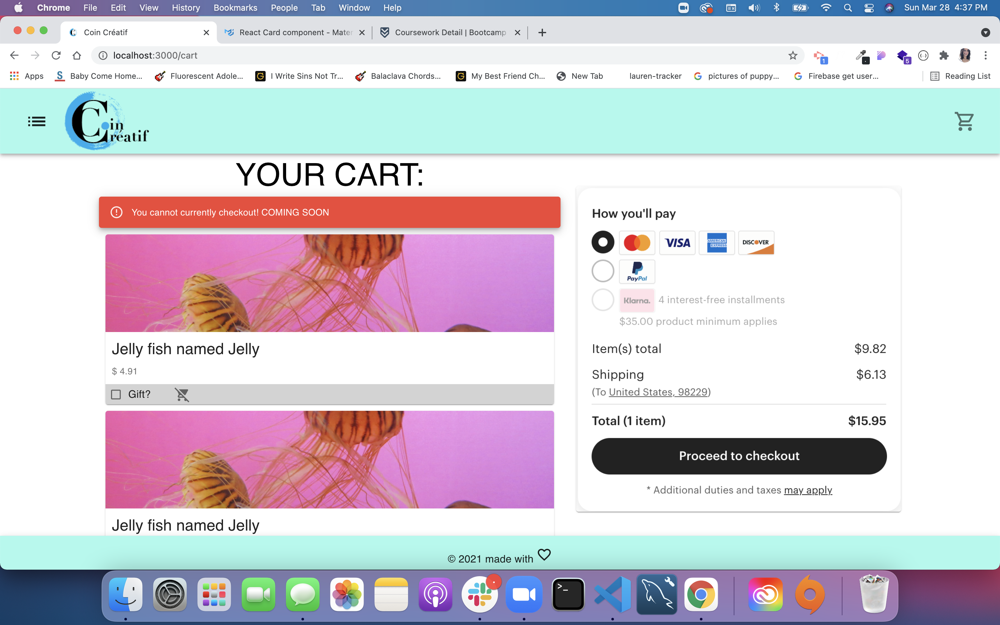

<h1 align="center">Coin Creatif

=============================
</h1>

<h2 align="center">Application Description

=============================
</h2>

This is an application for artist and creative types. Using react we've made a user friendly and mobile forward website. It is a platform to showcase and sell handmade items with the ability to post new items and checkout items as well once you have logged into your account.


<h2 align="center">Table of Contents: 

=============================
</h2>

<h4 align="center">

 [Description](#description) ||
 [User Story](#user-story) ||
 [Technologies Used](#technologies-used) ||
 [Future Development](#future-development) ||
 [Team Members](#team-members) ||
 [License](#License) ||
</h4>


<h2 align="center">💻 HTML generated: 

=============================
</h2>

<h4 align="center">

[Live Application on Heroku](https://coincreatif.herokuapp.com/)

</h4>

<h2 align="center">Figure Showing Main Page: 

=============================
</h2>


<h2 align="center">Figure Showing Product Page:

=============================
</h2>



<h2 align="center">Figure Showing Cart Page:

=============================
</h2>




<h2 align="center">User Story

=============================
</h2>

```
AS A creative artist/seller:
I WANT TO modify the list of products such as adding/removing products 
Modify product images 
Select a category for the products
Adjust quantity of items, and click to navigate product detail page
SO THAT I can adjust my offerings as a vendor/seller overtime
```

<h2 align="center">Presentation Slides

=============================
</h2>

<h4 align="center">
 
[Coin Creatif Presentation](https://docs.google.com/presentation/d/1h64WA1CeR1kQq62r7KANrQg59d3L6oLDPBxMk4htD1U/edit#slide=id.g29f43f0a72_0_24)

</h4>

<h2 align="center">Technology Used

=============================
</h2>

```
- React
- Express
- Axios
- Mongoose
- Node
- Heroku : for deployment
- if-env
- Marterial- UI

```

<h2 align="center">Future Development

=============================
</h2>

```
Our future plans to further develop this application are to get the cart fully functioning using Stripe, add in the ability to delete and alter products that you as a seller have posted, and to add in geo location that will connect sellers and buyers to items in their area.

```

<h2 align="center">Team Members

=============================
</h2>

<h4 align="center">

Amethyst White
[GitHub](https://github.com/Am-White)  ||
[Linkedin](https://www.linkedin.com/in/amethyst-white-1942761b7/)

Elizabeth Brandt
[GitHub](https://github.com/elizabethbrandt)  ||
[Linkedin](https://www.linkedin.com/in/elizabeth-brandt-pnw/)

Francine Babauta
[GitHub](https://github.com/fbabauta) ||
[Linkedin](www.linkedin.com/in/francine-babauta)

Jainanie Kaganovsky
[GitHub](https://github.com/jkaganovsky) ||
[Linkedin](https://www.linkedin.com/in/jailanie-kaganovsky-573a00116/)

</h4>


<h2 align="center">License

=============================
</h2>


Copyright <2021> <Coin Creatif Team>

Permission is hereby granted, free of charge, to any person obtaining a copy of this software and associated documentation files (the "Software"), to deal in the Software without restriction, including without limitation the rights to use, copy, modify, merge, publish, distribute, sublicense, and/or sell copies of the Software, and to permit persons to whom the Software is furnished to do so, subject to the following conditions:

The above copyright notice and this permission notice shall be included in all copies or substantial portions of the Software.

THE SOFTWARE IS PROVIDED "AS IS", WITHOUT WARRANTY OF ANY KIND, EXPRESS OR IMPLIED, INCLUDING BUT NOT LIMITED TO THE WARRANTIES OF MERCHANTABILITY, FITNESS FOR A PARTICULAR PURPOSE AND NONINFRINGEMENT. IN NO EVENT SHALL THE AUTHORS OR COPYRIGHT HOLDERS BE LIABLE FOR ANY CLAIM, DAMAGES OR OTHER LIABILITY, WHETHER IN AN ACTION OF CONTRACT, TORT OR OTHERWISE, ARISING FROM, OUT OF OR IN CONNECTION WITH THE SOFTWARE OR THE USE OR OTHER DEALINGS IN THE SOFTWARE.
